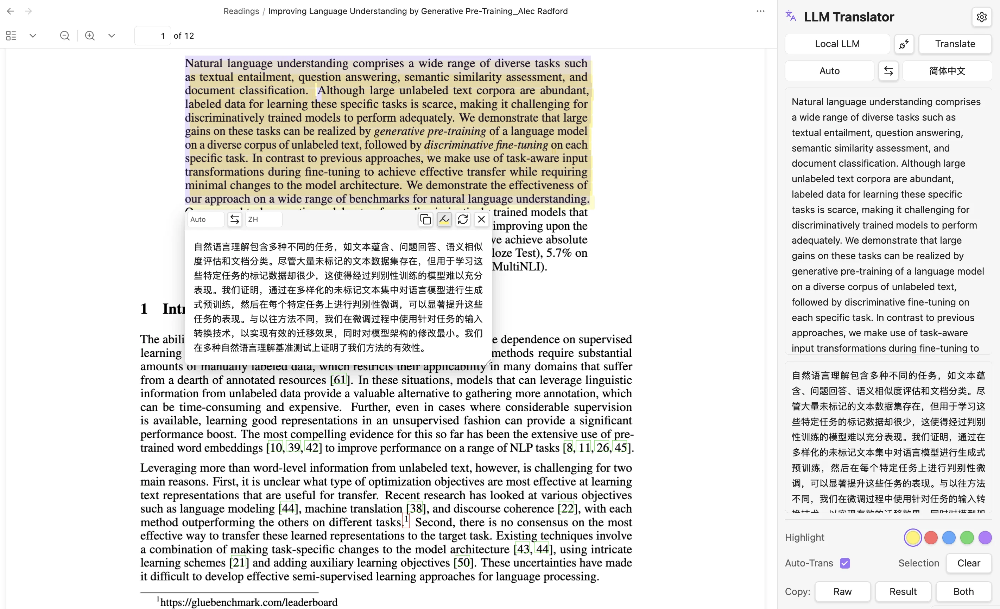

<p align="right">
  <a href="README.md"></a>
  <a href="README_CN.md"></a>
</p>

# LLM Translator

<p align="center">
  
  
  
  
</p>

<p align="center">
  <a href="#features">Features</a> •
  <a href="#quick-start">Quick Start</a> •
  <a href="#recommended-settings">Recommended Settings</a> •
  <a href="#usage-guide">Usage Guide</a> •
  <a href="#other-translation-services">Other Services</a> •
  <a href="#windows-notes">Windows Notes</a> •
  <a href="#faq">FAQ</a> •
  <a href="#development">Development</a>
</p>

<p align="center">A local LLM-powered translation plugin for Obsidian, supporting real-time text selection translation in PDF and Markdown files.</p>

<p align="center">
  
</p>

---

## Features

### 📌 Multiple Translation Sources

- **Local LLM (Ollama)** — Private, offline, unlimited usage
- **Cloud API (OpenAI-Compatible)** — Connect DeepSeek, OpenRouter, and more
- **Google Translate / Bing Translate** — No config needed, one-click switch

### 📄 Multi-format Document Support

- **PDF Documents** — Default support, auto-translate on selection
- **Markdown Documents** — Enable "Global" mode in settings

### 🎯 Smart Interaction

- Auto-popup translation window on text selection
- Sidebar translation panel for manual input
- Copy / Retry / One-click language switch
- Custom translation prompt for professional needs

### 🌐 Multi-language Interface

- Automatically follows Obsidian system language
- Supports Chinese / English interface

### ✏️ Native PDF Highlight Annotations

- **Persistent highlights** — Written as standard PDF annotations, visible across all PDF readers
- **5 colors** — Yellow, Red, Blue, Green, Purple; configurable default
- **Highlight notes** — Click any highlight to attach a note, stored in the PDF
- **Toggle & undo** — Click again to remove, Cmd+Z / Ctrl+Z to undo

---

## Quick Start

```bash
# 1. Install Ollama (macOS / Linux)
curl -fsSL https://ollama.com/install.sh | sh

# 2. Pull translation model (recommended HY-MT2-1.8B)
ollama pull RogerBen/HY-MT2-1.8B:latest

# 3. After installing the plugin, select Local LLM in settings
#    Enter endpoint http://localhost:11434 and model name
#    Click Test to verify connection
```

> 💡 **Windows Users**: Download the installer from the [Ollama website](https://ollama.com/). Ollama will run automatically in the background after installation.

### Install Plugin

Download and install via Terminal:

```bash
# Create plugin directory
mkdir -p YourVault/.obsidian/plugins/llm-translator

# Download Release files
curl -sL https://github.com/KimFischer99/Obsidian-LLM-Translator/releases/download/0.3.0/main.js \
  -o YourVault/.obsidian/plugins/llm-translator/main.js
curl -sL https://github.com/KimFischer99/Obsidian-LLM-Translator/releases/download/0.3.0/manifest.json \
  -o YourVault/.obsidian/plugins/llm-translator/manifest.json
curl -sL https://github.com/KimFischer99/Obsidian-LLM-Translator/releases/download/0.3.0/styles.css \
  -o YourVault/.obsidian/plugins/llm-translator/styles.css
```

Replace `YourVault` with your Obsidian vault path. Restart Obsidian and enable LLM Translator in **Settings → Community plugins**.

---

## Recommended Settings

After installing the plugin, configure as follows:

### General Settings

| Setting | Recommended Value |
|---------|-------------------|
| Translation scope | Global |
| Auto-translate selected text | Enabled |
| Enable reader selection popup | Enabled |

### Service Settings

| Setting | Recommended Value |
|---------|-------------------|
| Translation service | Local LLM |
| Local model endpoint | `http://localhost:11434` |
| Model name | `hy-mt2-1.8b-q4:latest` |
| Source language | Auto |
| Target language | 简体中文 |

### Advanced Settings

| Setting | Recommended Value |
|---------|-------------------|
| Max selection length | 5000 |
| Selection trigger delay | 350ms |
| Request timeout | 30000ms |
| Top K | 20 |
| Top P | 0.6 |
| Repeat Penalty | 1.05 |
| Num Predict | 4096 |

---

## Usage Guide

### Basic Operations

1. **Auto-translate** — Select text in PDF or Markdown, translation popup appears automatically
2. **Sidebar** — Click the language icon on the left toolbar to open the right-side translation panel
3. **Manual translate** — Enter text in the sidebar and click Translate

### Translation Scope

- **Global** — Both PDF and Markdown support selection translation
- **PDF only** — Only enable in PDF files (default)

### Sidebar Features

- **Translation service switch** — Quickly switch Local LLM / Cloud API / Google / Bing
- **Language selection** — Set source and target languages
- **Auto-Trans** — Toggle auto-translation
- **Copy** — Copy source (Raw), translation (Result), or Both
- **Clear** — Clear current translation history

### Custom Prompt

Modify the translation prompt in **Settings → Advanced → Custom prompt**:

```
Translate the following academic text. Preserve technical terminology,
citations, and formulas. Output only the translation.
```

---

## Other Translation Services

### Cloud API (OpenAI-Compatible)

Supports any OpenAI-compatible API provider:

| Configuration | Description |
|-------------|-------------|
| API URL | Provider's endpoint |
| API Key | Provider's authentication key |
| Model name | Provider's model identifier |

### Google Translate / Bing Translate

No configuration required. Select directly from the translation service dropdown.

> ⚠️ Free translation services have rate limits. For heavy usage, switch to local models or cloud APIs.

---

## Windows Notes

### Ollama Installation

- Download the Windows installer from the [Ollama website](https://ollama.com/)
- Runs automatically in the background after installation
- Port is the same as macOS: `http://localhost:11434`
- If connection fails, check Windows Firewall settings

### URL Format

- Use forward slashes `/`: `http://localhost:11434` (correct)
- Do not use backslashes: `http://localhost:11434\` (wrong)

---

## FAQ

### Connection test failed?

1. Confirm Ollama is running (there should be an Ollama icon in the taskbar)
2. Try accessing `http://localhost:11434` in your browser to verify
3. Check if another program is using port 11434

### Translation popup not showing?

- Confirm "Auto-translate selected text" and "Enable reader selection popup" are enabled
- Try restarting Obsidian

### Markdown files won't translate?

- Set "Translation scope" to "Global"

---

## Development

```bash
# Install dependencies
npm install

# Development mode (watch for file changes)
npm run dev

# Production build
npm run build
```

After building, copy `main.js`, `manifest.json`, and `styles.css` to:

```
YourVault/.obsidian/plugins/llm-translator/
```

---

## License

MIT License © 2026
